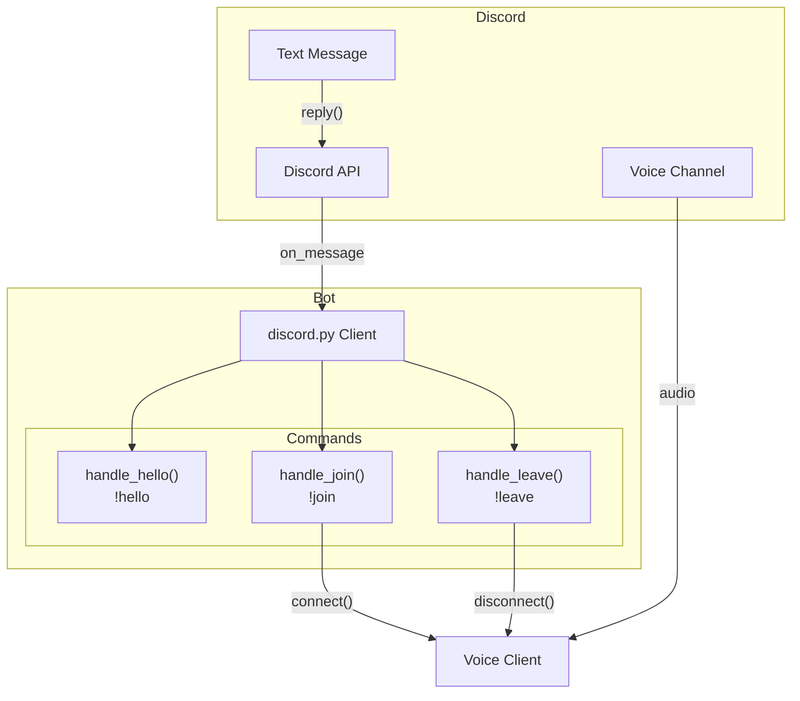
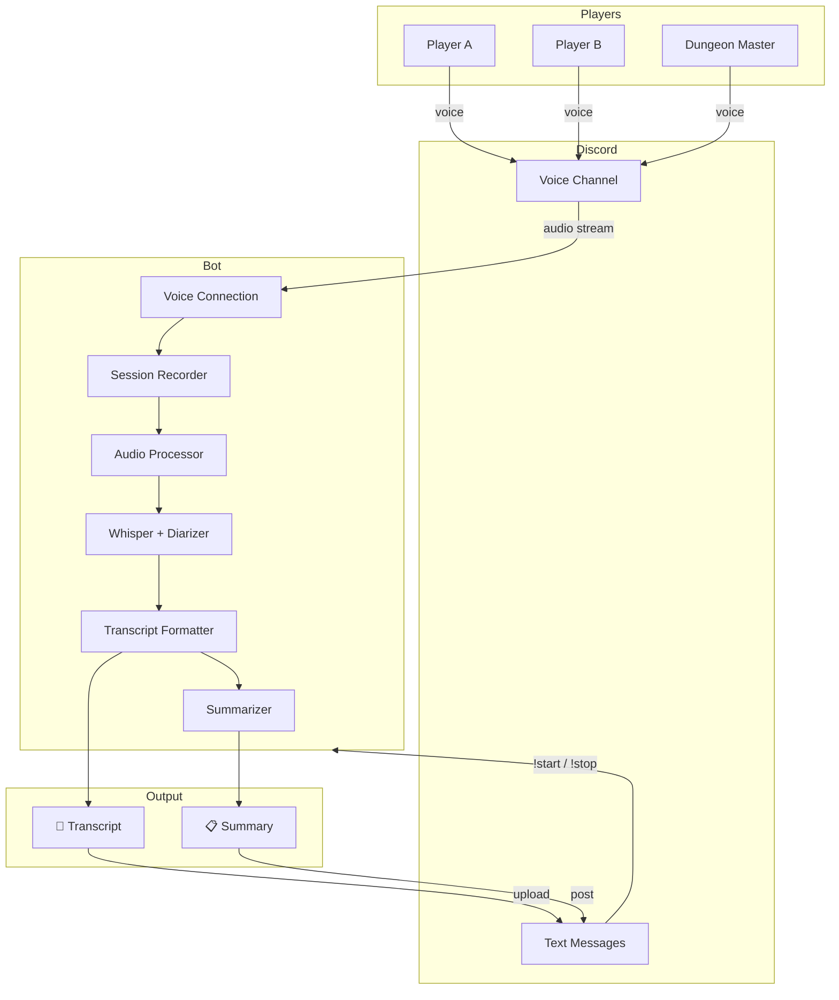

# Architecture

> Keep this file up-to-date with the latest implementation changes.

______________________________________________________________________

## Current State (Phase +1: Skateboard)

### Concepts

| Concept        | Responsibility                                       |
| -------------- | ---------------------------------------------------- |
| `Bot`          | Manages Discord connection, intents, message routing |
| `Config`       | Loads environment config (`DISCORD_BOT_TOKEN`)       |
| `handle_hello` | Responds with greeting                               |
| `handle_join`  | Connects to user's voice channel                     |
| `handle_leave` | Disconnects from voice channel                       |

______________________________________________________________________

## Planned 🗓

### Concepts

| Concept       | Responsibility           | Phase |
| ------------- | ------------------------ | ----- |
| `Recorder`    | Capture audio per user   | +2    |
| `Processor`   | Merge, normalize audio   | +2    |
| `Transcriber` | Whisper for STT          | +3    |
| `Diarizer`    | pyannote for speaker IDs | +4    |
| `Formatter`   | Markdown with timestamps | +4    |
| `Summarizer`  | LLM for session summary  | +5    |

______________________________________________________________________

*Last updated: +1 (Skateboard)*
